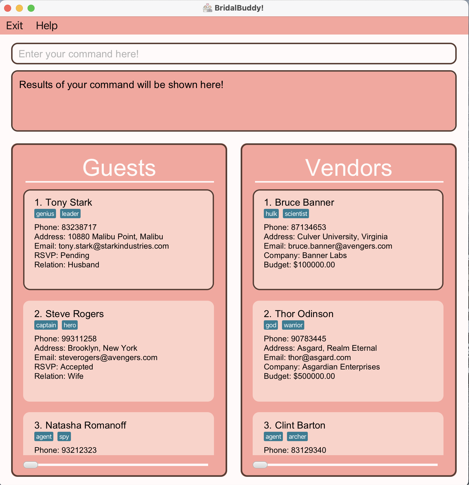
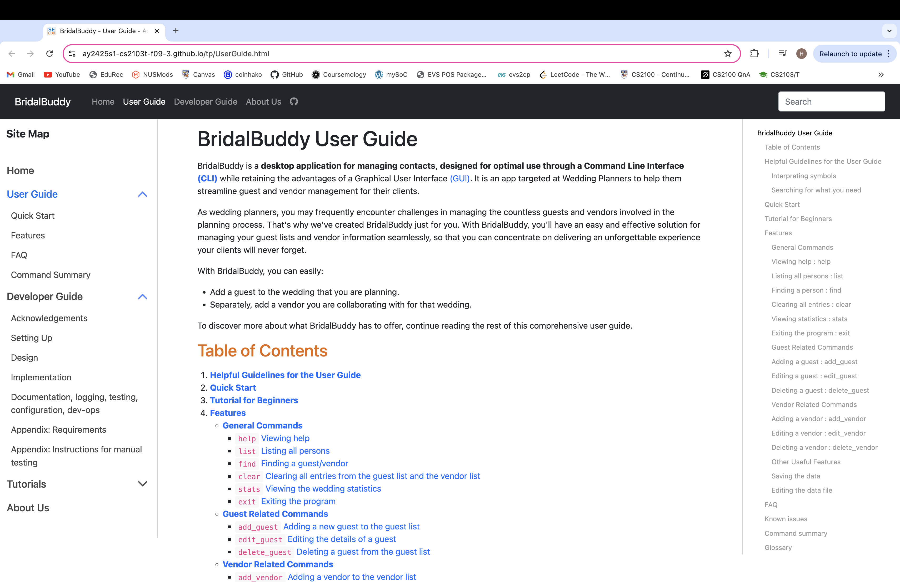

# BridalBuddy User Guide

BridalBuddy is a **desktop application for managing contacts, designed for optimal use through a Command Line Interface [(CLI)](#glossary)** while retaining the advantages of a Graphical User Interface [(GUI)](#glossary).
It is an app targeted at Wedding Planners to help them streamline guest and vendor management for their clients.

As wedding planners, you may frequently encounter challenges in managing the countless guests and vendors involved in the planning process.
That's why we've created BridalBuddy just for you. With BridalBuddy, you'll have an easy and effective solution for managing your guest lists and vendor information seamlessly, so that you can concentrate on delivering an unforgettable experience your clients will never forget.

With BridalBuddy, you can easily:
* Add a guest to the wedding that you are planning.
* Separately, add a vendor you are collaborating with for that wedding.

To discover more about what BridalBuddy has to offer, continue reading the rest of this comprehensive user guide.

## Table of Contents
1. [**Helpful Guidelines for the User Guide**](#helpful-guidelines-for-the-user-guide)
2. [**Quick Start**](#quick-start)
3. [**Tutorial for Beginners**](#tutorial-for-beginners)
4. [**Features**](#features)
    * [**Accessing Input History**](#accessing-input-history)
    * [**General Commands**](#general-commands)
        * [`help` Viewing help](#viewing-help--help)
        * [`stats` Viewing the total number of guests and vendors](#view-total-number-of-people--stats)
        * [`find` Finding a person](#finding-a-person--find)
        * [`clear` Clears all entries from the guest list and the vendor list](#clearing-all-entries--clear)
        * [`exit` Exiting the program](#exiting-the-program--exit)
    * [**Guest Related Commands**](#guest-related-commands)
        * [`add_guest` Adding a new guest to the guest list](#adding-a-guest--add_guest)
        * [`edit_guest` Editing the details of a guest](#editing-a-guest--edit_guest)
        * [`delete_guest` Deleting a guest from the guest list](#deleting-a-guest--delete_guest)
    * [**Vendor Related Commands**](#vendor-related-commands)
        * [`add_vendor` Adding a vendor to the vendor list](#adding-a-vendor--add_vendor)
        * [`edit_vendor` Editing the details of a vendor](#editing-a-vendor--edit_vendor)
        * [`delete_vendor` Deleting a student](#deleting-a-vendor--delete_vendor)
    * [**Miscellaneous**](#miscellaneous)
        * [Saving the data](#saving-the-data)
        * [Editing the data file](#editing-the-data-file)
5. [**FAQ**](#faq)
6. [**Known Issues**](#known-issues)
7. [**Command summary**](#command-summary)
8. [**Glossary**](#glossary)

--------------------------------------------------------------------------------------------------------------------

## Helpful Guidelines for the User Guide

### Interpreting symbols

This section explains the symbols that you will find in the rest of the User Guide.

| Symbol               | Meaning                                            |
|----------------------|----------------------------------------------------|
| :warning:            | Important information! Please read them carefully. |
| :information_source: | Information that you should take note of.          |
| :bulb:               | Additional useful tips.                            |

### Searching for what you need

This section tells you what information you will find in each of the sections of this guide. Feel free to skip to the sections which you need most.

1. [Quick Start](#quick-start) teaches you how to set up BridalBuddy.
2. [Tutorial for Beginners](#tutorial-for-beginners) walks you through the basic features of BridalBuddy to get you started.
3. [Features](#features) helps you understand how all our features work.
4. [FAQ](#faq) clarifies the doubts that many of our users have.
5. [Command Summary](#command-summary) summarises all our features for easy reference.
6. [Glossary](#glossary) explains the more technical terms used in this guide.
7. [_Back to Top_](#table-of-contents) gives you a convenient shortcut to go back to the table of contents.

[_Back to Top_](#table-of-contents)

--------------------------------------------------------------------------------------------------------------------

## Quick Start

1. Ensure you have Java `17` or above installed in your Computer. Click [here](https://www.oracle.com/java/technologies/javase/jdk17-archive-downloads.html) to download Java 17 if you do not already have it installed.
    > To check 

2. Download the latest `.jar` file from [here](https://github.com/AY2425S1-CS2103T-F09-3/tp/releases).

3. Copy the file to the folder you want to use as the _home folder_ for your AddressBook.

4. Open a command terminal, `cd` into the folder you put the jar file in, and use the `java -jar addressbook.jar` command to run the application. 
   A GUI similar to the below should appear in a few seconds. Note how the app contains some sample data. 
   

5. Type the command in the command box and press Enter to execute it. e.g. typing **`help`** and pressing Enter will open the help window. 
   Some example commands you can try:

    * `list` : Lists all contacts.

    * `add n/John Doe p/98765432 e/johnd@example.com a/John street, block 123, #01-01` : Adds a contact named `John Doe` to the Address Book.

    * `delete 3` : Deletes the 3rd contact shown in the current list.

    * `clear` : Deletes all contacts.

    * `exit` : Exits the app.

6. Refer to the [Features](#features) below for details of each command.

[_Back to Top_](#table-of-contents)

--------------------------------------------------------------------------------------------------------------------

## Tutorial for Beginners

This section will walk you through all the basic features of BridalBuddy and will make sure you know everything you need to get started.

--------------------------------------------------------------------------------------------------------------------

## Features

<box type="info" seamless>

**Notes about the command format:** 

* Words in `UPPER_CASE` are the parameters to be supplied by the user. 
  e.g. in `add n/NAME`, `NAME` is a parameter which can be used as `add n/John Doe`.

* Items in square brackets are optional. 
  e.g `n/NAME [t/TAG]` can be used as `n/John Doe t/friend` or as `n/John Doe`.

* Items with `…`​ after them can be used multiple times including zero times. 
  e.g. `[t/TAG]…​` can be used as ` ` (i.e. 0 times), `t/friend`, `t/friend t/family` etc.

* Parameters can be in any order. 
  e.g. if the command specifies `n/NAME p/PHONE_NUMBER`, `p/PHONE_NUMBER n/NAME` is also acceptable.

* Extraneous parameters for commands that do not take in parameters (such as `help`, `list`, `exit` and `clear`) will be ignored. 
  e.g. if the command specifies `help 123`, it will be interpreted as `help`.

* If you are using a PDF version of this document, be careful when copying and pasting commands that span multiple lines as space characters surrounding line-breaks may be omitted when copied over to the application.
</box>

### Viewing help : `help`

Shows a message explaning how to access the help page.

**Format:** `help`

Entering the `help` command returns the following result on your screen:

### Adding a person: `add`

Adds a person to the address book.

Format: `add n/NAME p/PHONE_NUMBER e/EMAIL a/ADDRESS [t/TAG]…​`

<box type="tip" seamless>

**Tip:** A person can have any number of tags (including 0)
</box>

Examples:
* `add n/John Doe p/98765432 e/johnd@example.com a/John street, block 123, #01-01`
* `add n/Betsy Crowe t/friend e/betsycrowe@example.com a/Newgate Prison p/1234567 t/criminal`

### Listing all persons : `list`

Shows a list of all persons in the address book.

Format: `list`

### Editing a person : `edit`

Edits an existing person in the address book.

Format: `edit INDEX [n/NAME] [p/PHONE] [e/EMAIL] [a/ADDRESS] [t/TAG]…​`

* Edits the person at the specified `INDEX`. The index refers to the index number shown in the displayed person list. The index **must be a positive integer** 1, 2, 3, …​
* At least one of the optional fields must be provided.
* Existing values will be updated to the input values.
* When editing tags, the existing tags of the person will be removed i.e adding of tags is not cumulative.
* You can remove all the person’s tags by typing `t/` without
    specifying any tags after it.

Examples:
*  `edit 1 p/91234567 e/johndoe@example.com` Edits the phone number and email address of the 1st person to be `91234567` and `johndoe@example.com` respectively.
*  `edit 2 n/Betsy Crower t/` Edits the name of the 2nd person to be `Betsy Crower` and clears all existing tags.

### Locating persons by name: `find`

Finds persons whose names contain any of the given keywords.

Format: `find KEYWORD [MORE_KEYWORDS]`

* The search is case-insensitive. e.g `hans` will match `Hans`
* The order of the keywords does not matter. e.g. `Hans Bo` will match `Bo Hans`
* Only the name is searched.
* Only full words will be matched e.g. `Han` will not match `Hans`
* Persons matching at least one keyword will be returned (i.e. `OR` search).
  e.g. `Hans Bo` will return `Hans Gruber`, `Bo Yang`

Examples:
* `find John` returns `john` and `John Doe`
* `find alex david` returns `Alex Yeoh`, `David Li` 
  

### Deleting a person : `delete`

Deletes the specified person from the address book.

Format: `delete INDEX`

* Deletes the person at the specified `INDEX`.
* The index refers to the index number shown in the displayed person list.
* The index **must be a positive integer** 1, 2, 3, …​

Examples:
* `list` followed by `delete 2` deletes the 2nd person in the address book.
* `find Betsy` followed by `delete 1` deletes the 1st person in the results of the `find` command.

### Clearing all entries : `clear`

Clears all entries from the address book.

Format: `clear`

### Exiting the program : `exit`

Exits the program.

Format: `exit`

### Saving the data

AddressBook data are saved in the hard disk automatically after any command that changes the data. There is no need to save manually.

### Editing the data file

AddressBook data are saved automatically as a JSON file `[JAR file location]/data/addressbook.json`. Advanced users are welcome to update data directly by editing that data file.

<box type="warning" seamless>

**Caution:**
If your changes to the data file makes its format invalid, AddressBook will discard all data and start with an empty data file at the next run.  Hence, it is recommended to take a backup of the file before editing it. 
Furthermore, certain edits can cause the AddressBook to behave in unexpected ways (e.g., if a value entered is outside the acceptable range). Therefore, edit the data file only if you are confident that you can update it correctly.
</box>

### Archiving data files `[coming in v2.0]`

_Details coming soon ..._

--------------------------------------------------------------------------------------------------------------------

## FAQ

**Q**: How do I transfer my data to another Computer? 
**A**: Install the app in the other computer and overwrite the empty data file it creates with the file that contains the data of your previous AddressBook home folder.

--------------------------------------------------------------------------------------------------------------------

## Known issues

1. **When using multiple screens**, if you move the application to a secondary screen, and later switch to using only the primary screen, the GUI will open off-screen. The remedy is to delete the `preferences.json` file created by the application before running the application again.
2. **If you minimize the Help Window** and then run the `help` command (or use the `Help` menu, or the keyboard shortcut `F1`) again, the original Help Window will remain minimized, and no new Help Window will appear. The remedy is to manually restore the minimized Help Window.

--------------------------------------------------------------------------------------------------------------------

## Command summary

Action     | Format, Examples
-----------|----------------------------------------------------------------------------------------------------------------------------------------------------------------------
**Add**    | `add n/NAME p/PHONE_NUMBER e/EMAIL a/ADDRESS [t/TAG]…​`   e.g., `add n/James Ho p/22224444 e/jamesho@example.com a/123, Clementi Rd, 1234665 t/friend t/colleague`
**Clear**  | `clear`
**Delete** | `delete INDEX`  e.g., `delete 3`
**Edit**   | `edit INDEX [n/NAME] [p/PHONE_NUMBER] [e/EMAIL] [a/ADDRESS] [t/TAG]…​`  e.g.,`edit 2 n/James Lee e/jameslee@example.com`
**Find**   | `find KEYWORD [MORE_KEYWORDS]`  e.g., `find James Jake`
**List**   | `list`
**Help**   | `help`

## **Glossary**

| Term/Keyword                       | Definition                                                                                                 |
|------------------------------------|------------------------------------------------------------------------------------------------------------|
| **Command Line Interface (CLI)**   | An interface that allows you to interact with our program by inputting lines of text called command-lines. |
| **Graphical User Interface (GUI)** | An interface that displays information to you and allows you to interact with visual elements.             |
| **Prefix**                         | Characters preceding details you input on the command line. Eg. n/ for name and e/ for email.              |

[_Back to Top_](#table-of-contents)
