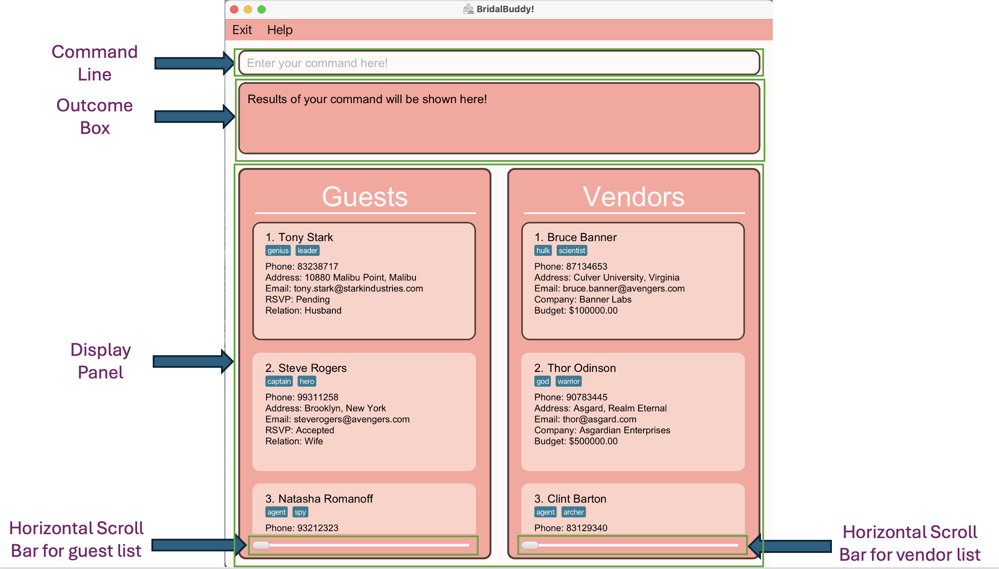
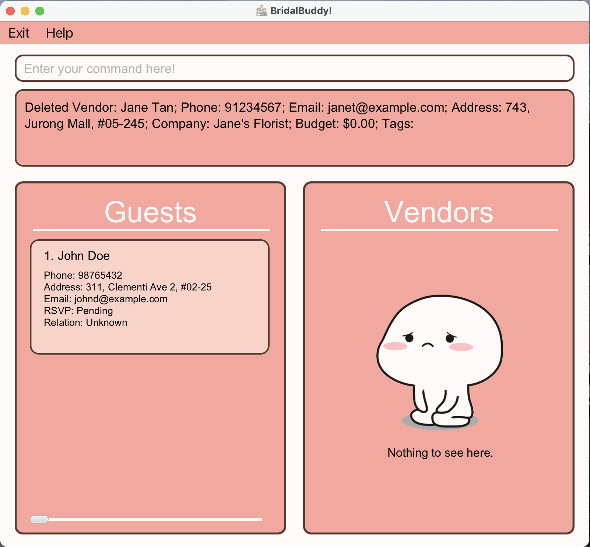
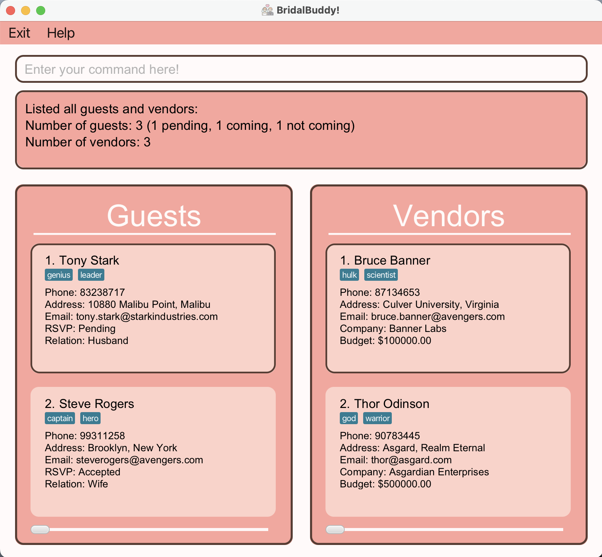
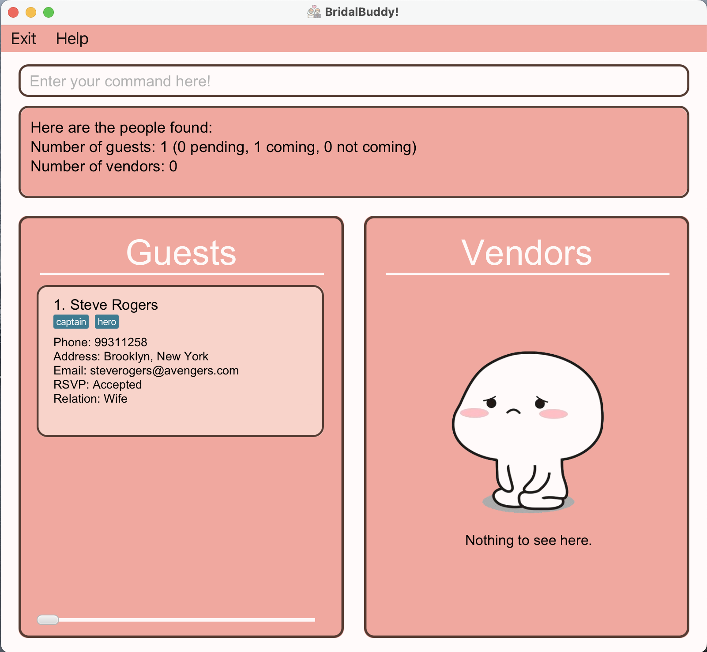
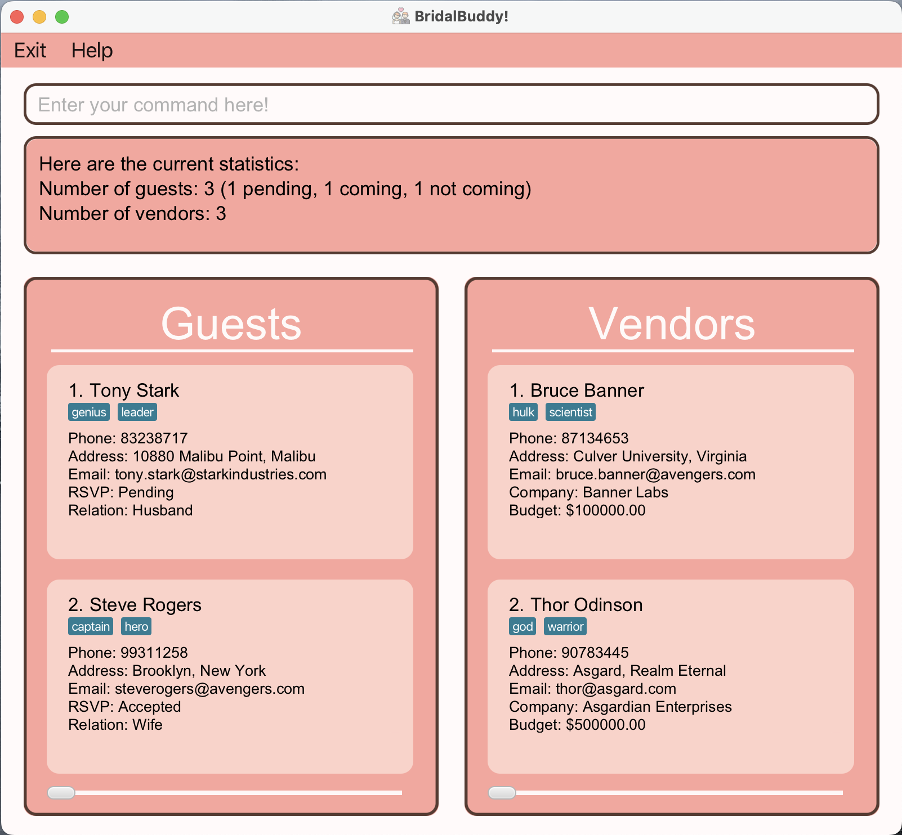
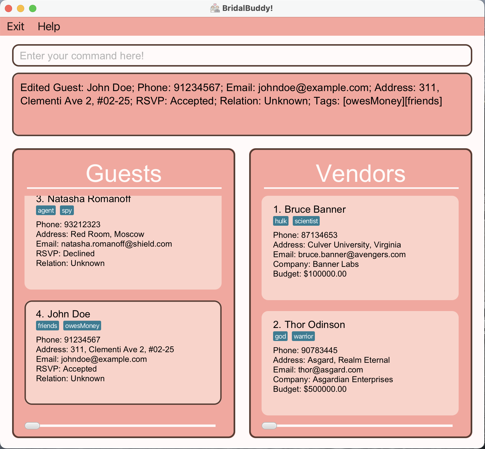
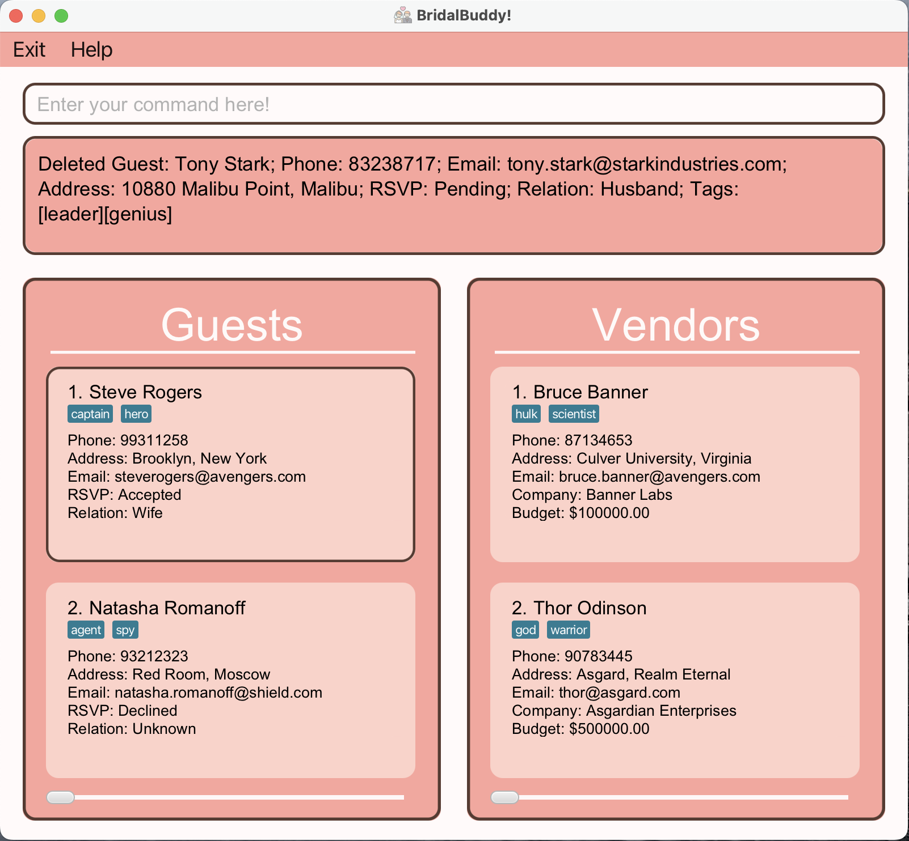
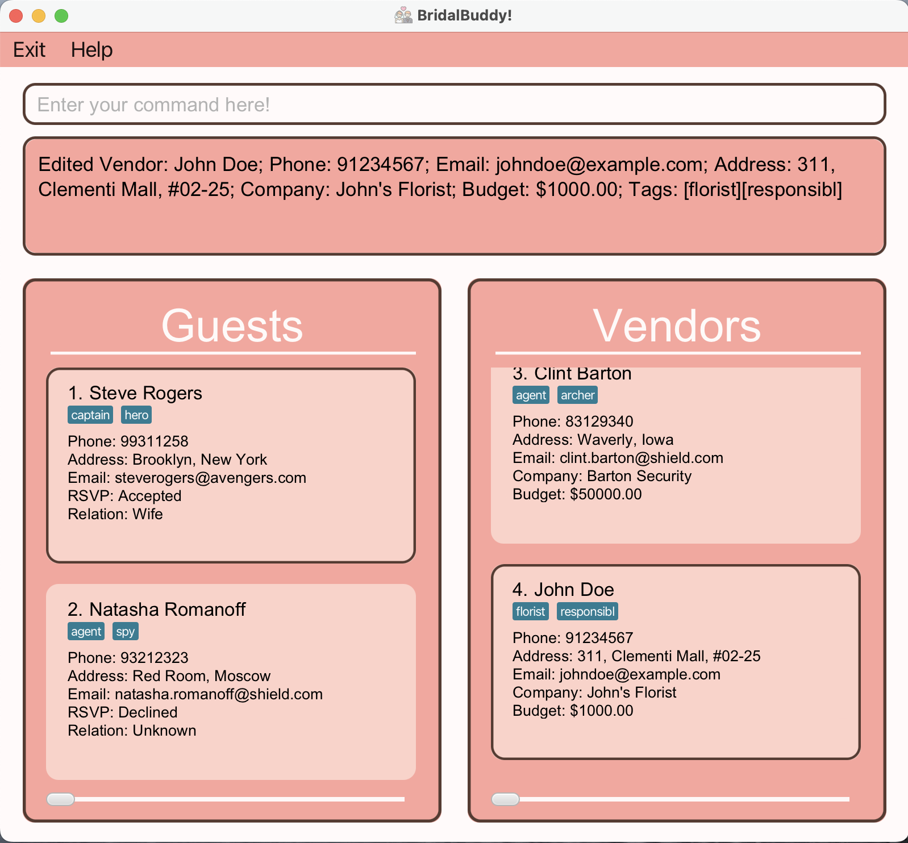
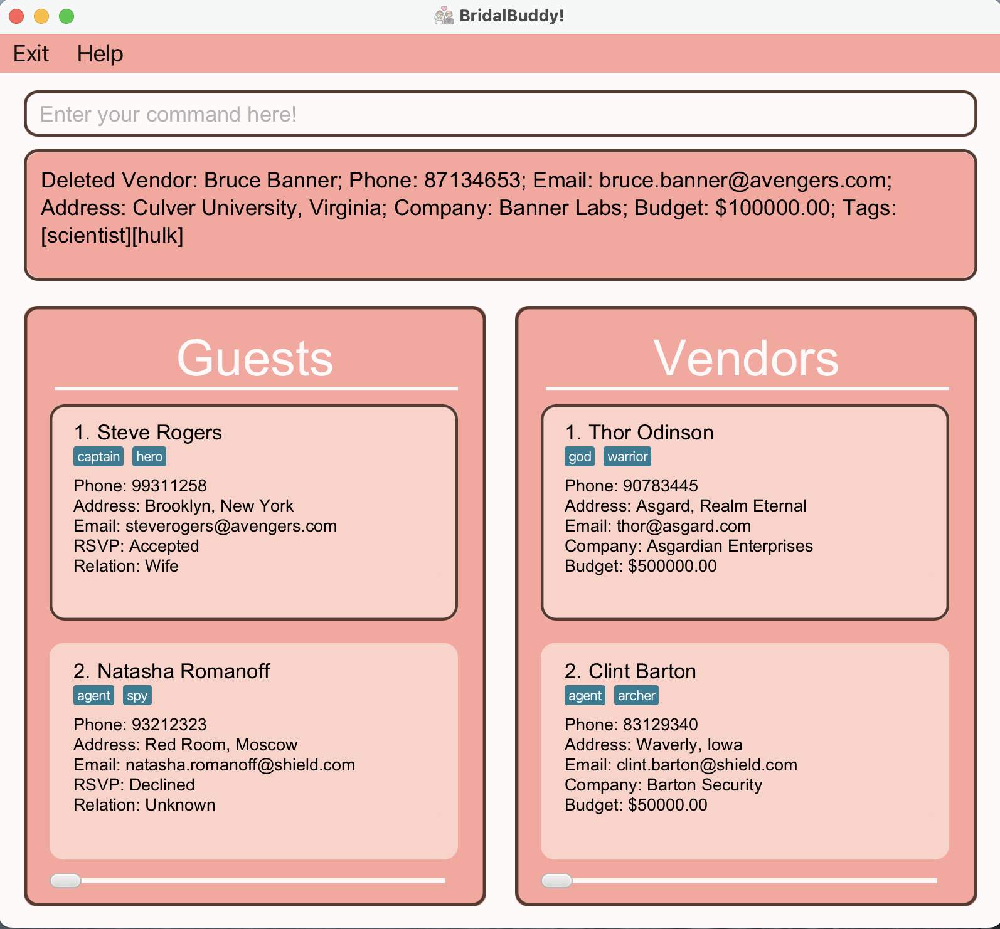

# BridalBuddy User Guide

BridalBuddy is a **desktop application for managing contacts, designed for optimal use through a Command Line Interface [(CLI)](https://ay2425s1-cs2103t-f09-3.github.io/tp/DeveloperGuide.html#glossary)** while retaining the advantages of a Graphical User Interface [(GUI)](https://ay2425s1-cs2103t-f09-3.github.io/tp/DeveloperGuide.html#glossary).
It is an app targeted at Wedding Planners to help them streamline guest and vendor management for their clients.

As wedding planners, you may frequently encounter challenges in managing the countless guests and vendors involved in the planning process.
That's why we've created BridalBuddy just for you. With BridalBuddy, you'll have an easy and effective solution for managing your guest lists and vendor information seamlessly, so that you can concentrate on delivering an unforgettable experience your clients will never forget.

With BridalBuddy, you can easily:
* Add a guest to the wedding that you are planning.
* Separately, add a vendor you are collaborating with for that wedding.

To discover more about what BridalBuddy has to offer, continue reading the rest of this comprehensive user guide.

## Table of Contents
1. [**Helpful Guidelines for the User Guide**](#helpful-guidelines-for-the-user-guide)
2. [**Quick Start**](#quick-start)
3. [**Tutorial for Beginners**](#tutorial-for-beginners)
   * [**Starting a fresh template**](#starting-a-fresh-template)
   * [**Adding guests**](#adding-guests)
   * [**Adding vendors**](#adding-vendors)
   * [**Deleting persons**](#deleting-persons)
   * [**Exiting the program**](#exiting-the-program)
4. [**Features**](#features)
    * [**General Commands**](#general-commands)
        * [`help` Viewing help](#viewing-help-help)
        * [`list` Listing all persons](#listing-all-persons-list)
        * [`find` Finding a guest/vendor](#finding-a-person-find)
        * [`clear` Clearing all entries from the guest list and the vendor list](#clearing-all-entries-clear)
        * [`stats` Viewing the wedding statistics](#viewing-statistics-stats)
        * [`exit` Exiting the program](#exiting-the-program-exit)
    * [**Guest Related Commands**](#guest-related-commands)
        * [`add_guest` Adding a new guest to the guest list](#adding-a-guest-add-guest)
        * [`edit_guest` Editing the details of a guest](#editing-a-guest-edit-guest)
        * [`delete_guest` Deleting a guest from the guest list](#deleting-a-guest-delete-guest)
    * [**Vendor Related Commands**](#vendor-related-commands)
        * [`add_vendor` Adding a vendor to the vendor list](#adding-a-vendor-add-vendor)
        * [`edit_vendor` Editing the details of a vendor](#editing-a-vendor-edit-vendor)
        * [`delete_vendor` Deleting a vendor from the vendor list](#deleting-a-vendor-delete-vendor)
    * [**Other Useful Features**](#other-useful-features)
        * [Saving the data](#saving-the-data)
        * [Editing the data file](#editing-the-data-file)
5. [**FAQ**](#faq)
6. [**Known Issues**](#known-issues)
7. [**Command summary**](#command-summary)

--------------------------------------------------------------------------------------------------------------------

## Helpful Guidelines for the User Guide

### Interpreting symbols

This section explains the symbols that you will find in the rest of the User Guide.

| Symbol               | Meaning                                            |
|----------------------|----------------------------------------------------|
| :warning:            | Important information! Please read them carefully. |
| :information_source: | Information that you should take note of.          |
| :bulb:               | Additional useful tips.                            |

### Searching for what you need

This section tells you what information you will find in each of the sections of this guide. Feel free to skip to the sections which you need most.

1. [Quick Start](#quick-start) teaches you how to set up BridalBuddy.
2. [Tutorial for Beginners](#tutorial-for-beginners) walks you through the basic features of BridalBuddy to get you started.
3. [Features](#features) helps you understand how all our features work.
4. [FAQ](#faq) clarifies the doubts that many of our users have.
5. [Command Summary](#command-summary) summarises all our features for easy reference.
6. [_Back to Top_](#table-of-contents) gives you a convenient shortcut to go back to the table of contents.

[_Back to Top_](#table-of-contents)

--------------------------------------------------------------------------------------------------------------------

## Quick Start

1. Ensure you have Java `17` or above installed in your Computer. Click [here](https://www.oracle.com/java/technologies/javase/jdk17-archive-downloads.html) to download Java `17` if you do not already have it installed.
    > :information_source: To check if you have Java `17` installed, simply run `java -version` on a command terminal to find out.

2. Download the latest `.jar` file from [here](https://github.com/AY2425S1-CS2103T-F09-3/tp/releases).

3. Copy the file to the folder you want to use as the _home folder_ for your BridalBuddy application.

4. Open a command terminal, `cd` into the folder you put the jar file in, and use the `java -jar bridalbuddy.jar` command to run the application. 
   A [(GUI)](https://ay2425s1-cs2103t-f09-3.github.io/tp/DeveloperGuide.html#glossary) similar to the below should appear in a few seconds. Note how the app contains some sample data. 
   
    > If you need any help opening a command terminal, you may find the relevant information [here](https://www.youtube.com/watch?v=8gUvxU7EoNE) (for Windows users) or [here](https://support.apple.com/en-sg/guide/terminal/apd5265185d-f365-44cb-8b09-71a064a42125/mac#:~:text=Click%20the%20Launchpad%20icon%20in,%2C%20then%20double%2Dclick%20Terminal.) (for macOS users).

5. Type the command in the command box and press Enter to execute it. e.g. typing **`help`** and pressing Enter will open the help window. 
   Some example commands you can try:

    * `list` : Lists down all guests invited to the wedding on the guest list and all vendors involved in the wedding on the vendor list.

    * `add_guest n/John Doe p/98765432 e/johnd@example.com a/311, Clementi Ave 2, #02-25 rsvp/A r/H t/friends t/owesMoney` : Adds a guest named `John Doe` to the guest list.

    * `delete_vendor 3` : Deletes the 3rd vendor shown in the current vendor list.

    * `exit` : Exits the app.

For a comprehensive tutorial on using BridalBuddy to manage your guest and vendor lists as a wedding planner, check out the [Tutorial for Beginners](#tutorial-for-beginners).
Alternatively, if you’d like to explore the application independently, refer to the [Features](#features) section below for detailed information on each command.

[_Back to Top_](#table-of-contents)

--------------------------------------------------------------------------------------------------------------------

## Tutorial for Beginners

If you are new to BridalBuddy, this section will walk you through all the most basic features of BridalBuddy and will make sure you know everything you need to get started.

### Tutorial Contents
1. [**Starting a fresh template**](#starting-a-fresh-template)
2. [**Adding guests**](#adding-guests)
3. [**Adding vendors**](#adding-vendors)
4. [**Deleting persons**](#deleting-persons)
5. [**Exiting the program**](#exiting-the-program)

**Let us explore the most basic features of BridalBuddy's from the perspective of a wedding planner.**
When you open up the application for the first time, you will see the interface below, with some sample guest and vendors on the guest list and the vendor list respectively.

At the top of the screen, there is a text box we will refer to as the *Command Line*. This is where you type in your commands to BridalBuddy.

To confirm your instructions, simply the <kbd>Enter</kbd> key on your keyboard.

Below the *Command Line* is the *Outcome Box*, which will tell you the outcome of the commands you have entered, as well as other relevant information related to that command.

Finally, below the *Outcome Box* is the *Display Panel*, which will contain the guest list and the vendor list for the wedding that you are planning.

[_Back to Top_](#table-of-contents)

### Starting a fresh template

In order to get ready to use BridalBuddy, let's first remove the existing sample guests and vendors on our guest list and vendor list.
All we have to do is to enter the command `clear` in the Command Line, and both the guest list and the vendor list will be emptied and ready for you to plan a new wedding.
> :bulb: Remember to hit the <kbd>Enter</kbd> key on your keyboard to confirm an instruction/command to BridalBuddy.

Once successful, you should see the following on your screen:

[_Back to Top_](#table-of-contents)

### Adding guests

Now let's say your customer, the groom, sends you the first guest he wishes to invite, and we want to add him to the guest list of the wedding.
Let us familiarise ourselves with the `add_guest` command, which you will need in order to add guests to the guest list.

Let's try entering the following command in the Command Line: `add_guest n/John Doe p/98765432 e/johnd@example.com a/311, Clementi Ave 2, #02-25`.

This means you are adding a new guest, with the name `John Doe`, phone number `98765432`, email `johnd@example.com` and address `311, Clementi Ave 2, #02-25` to the guest list.

Once successful, you should see the following on your screen:

For more details on the `add_guest` command, such as the additional optional fields you can classify a guest with, we encourage you to refer to [**Adding a new guest to the guest list**](#adding-a-guest-add-guest)

[_Back to Top_](#table-of-contents)

### Adding vendors

Let us now add a vendor to the list of vendors you are intending to collaborate with, and familiarise ourselves with the `add_vendor` command, which you will need in order to add vendors to the vendor list.

Let's try entering the following command in the Command Line: `add_vendor n/Jane Tan p/91234567 e/janet@example.com a/743, Jurong Mall, #05-245 c/Jane's Florist`.

This means you are adding a new vendor, with the name `Jane Tan`, phone number `91234567`, email `janet@example.com`, address `743, Jurong Mall, #05-245` and company name `Jane's Florist` to the vendor list.

Once successful, you should see the following on your screen:

For more details on the `add_vendor` command, such as the additional optional fields you can classify a vendor with, we encourage you to refer to [**Adding a new vendor to the vendor list**](#adding-a-vendor-add-vendor)

[_Back to Top_](#table-of-contents)

### Deleting persons

Suppose the bride tells us that she has a preferred florist in mind, and so you need to delete the florist you previously added to the vendor list.

Let's try the entering the following command in the Command Line: `delete_vendor 1`.

This means you are deleting the first person that is currently being listed on your vendor list, which is `Jane Tan`.

Once successful, you should see the following on your screen:

Deleting a guest works in a similar way but using the `delete_guest` command instead.
For more details on the `delete_guest` and `delete_vendor` commands, we encourage you to refer to [**Deleting a guest from the guest list**](#deleting-a-guest-delete-guest) and [**Deleting a vendor from the vendor list**](#deleting-a-vendor-delete-vendor) respectively.

[_Back to Top_](#table-of-contents)

### Exiting the program

It's been a long day at work. Now let's take a break and exit the application. All you have to do is simply enter the command `exit` in the Command Line, and the program will exit automatically in a few seconds!

* :information_source: Not to worry, your progress will be auto-saved and all your work will be reflected correctly the next time u open the app.

[_Back to Top_](#table-of-contents)

After trying out the tutorial, we strongly recommend you to explore our [features](#features) where you can discover the full range of tools and functionalities our app offers so that you can enhance your productivity and make the most out of BridalBuddy!

[_Back to Top_](#table-of-contents)

--------------------------------------------------------------------------------------------------------------------

## Features

<box type="info" seamless>

**:bulb: Notes about the command format:** 

* Words in `UPPER_CASE` are the parameters to be supplied by the user. 
  e.g. in `add n/NAME`, `NAME` is a parameter which can be used as `add n/John Doe`.

* Items in square brackets are optional. 
  e.g `n/NAME [t/TAG]` can be used as `n/John Doe t/friend` or as `n/John Doe`.

* Items with `…`​ after them can be used multiple times including zero times. 
  e.g. `[t/TAG]…​` can be used as ` ` (i.e. 0 times), `t/friend`, `t/friend t/family` etc.

* Parameters can be in any order. 
  e.g. if the command specifies `n/NAME p/PHONE_NUMBER`, `p/PHONE_NUMBER n/NAME` is also acceptable.

* Extraneous parameters for commands that do not take in parameters (such as `help`, `list`, `exit` and `clear`) will be ignored. 
  e.g. if the command specifies `help 123`, it will be interpreted as `help`.

* If you are using a PDF version of this document, be careful when copying and pasting commands that span multiple lines as space characters surrounding line-breaks may be omitted when copied over to the application.
</box>

[_Back to Top_](#table-of-contents)

---

### **General Commands**

Commands listed in this section are applicable to both guest management and vendor management, or for using the app in general.

[_Back to Top_](#table-of-contents)

### Viewing help : `help`

This command will open your web browser and redirect you to the online User Guide which will provide detailed instructions and resources for you to use the app.

* :warning: The online User Guide will require a stable internet connection to successfully open.

**Format:** `help`

**Example Usage:** `help`

[_Back to Top_](#table-of-contents)

### Listing all persons : `list`

This command will show you a guest list consisting of all invited guests and a vendor list consisting of all vendors involved in the current wedding that you are planning.

* The guest list will be on the left of your screen while the vendor list will be on the right of your screen.

**Format:** `list`

**Example Usage:** `list`

Entering the `list` command returns the following result on your screen (using sample `Guest` data and  `Vendor` data):

[_Back to Top_](#table-of-contents)

### Finding a person : `find`

This command will help you find guests and vendors that match any of the given keyword(s) that you provide.

**Format:** `find [n/NAME] [p/PHONE] [e/EMAIL] [a/ADDRESS] [rsvp/RSVP] [r/relation] [c/COMPANY] [b/BUDGET] [t/TAG]...`

> :warning: **Exactly** one type of [prefix](https://ay2425s1-cs2103t-f09-3.github.io/tp/DeveloperGuide.html#glossary) should be used for each `find` command.

- Specifying multiple different prefixes (e.g. `find n/John p/12345`) will result in an invalid command
- The prefix specified in the command indicates the attribute to be searched (e.g. `find n/NAME` searches for guests and vendors whose name matches the given keyword)
- The search is case-insensitive for all fields (e.g. `jOhN` will match `John`)
- The order of the keywords does not matter. e.g. `John Doe` will match `Doe John`
- Only full words will be matched e.g. `Jo` will not match `John`
- Guest/Vendor matching **any** of the keywords will be returned (e.g. `John Tan` will return `John Doe` and `Alan Tan`)

**Example Usage:** `find n/Steve`

Entering the `find n/Steve` command returns the following result on your screen (using sample `Guest` data and  `Vendor` data):

[_Back to Top_](#table-of-contents)

### Clearing all entries : `clear`

This command will help you clear and empty out the entire guest list and vendor list, and could be good to help you start off your preparations for the next wedding.

**Format:** `clear`

**Example Usage:** `clear`

Entering the `clear` command returns the following result on your screen:

[_Back to Top_](#table-of-contents)

### Viewing statistics : `stats`

This command will display to you the total number of guests invited to the wedding and the total number of vendors involved in the wedding.

**Format:** `stats`

**Example Usage:** `stats`

Entering the `stats` command returns the following result on your screen (using sample `Guest` data and  `Vendor` data):

[_Back to Top_](#table-of-contents)

### Exiting the program : `exit`

This command will exit the program.

Format: `exit`

**Example Usage:** `exit`

[_Back to Top_](#table-of-contents)

---

### **Guest Related Commands**

Commands listed in this section are applicable to managing your guest list (guest management).

[_Back to Top_](#table-of-contents)

### Adding a guest : `add_guest`

This command will help you add a new guest to the bottom of the existing overall guest list.

**Format:** `add_guest n/NAME p/PHONE e/EMAIL a/ADDRESS [rsvp/RSVP] [r/RELATION] [t/TAG]...`

> :warning: You can only enter 'P' for pending, 'A' for accepted or 'D' for declined for the optional `RSVP` field.

> :warning: You can only enter 'H' for related to husband, 'W' for related to wife or 'U' for unknown for the optional `RELATION` field.

> :warning: If you attempt to add a new guest with both the same `NAME` and `PHONE` as another existing guest in the guest list, an error will be shown.

* :information_source: As of now, BridalBuddy only supports one single word per tag.

**Example Usage:** `add_guest n/John Doe p/98765432 e/johnd@example.com a/311, Clementi Ave 2, #02-25 rsvp/A r/U t/friends t/owesMoney`

Entering the `add_guest n/John Doe p/98765432 e/johnd@example.com a/311, Clementi Ave 2, #02-25 rsvp/A r/U t/friends t/owesMoney` command returns the following result on your screen:

[_Back to Top_](#table-of-contents)

### Editing a guest : `edit_guest`

This command will allow you to edit the details of the guest identified by the `INDEX` number used in the displayed guest list. Existing values will be overwritten by the input values.

**Format:** `edit_guest INDEX [n/NAME] [p/PHONE] [e/EMAIL] [a/ADDRESS] [rsvp/RSVP] [r/RELATION] [t/TAG]...`

> :warning: If you attempt to edit the details of an existing guest such that they end up with both the same `NAME` and `PHONE` as another existing guest in the guest list, an error will be shown.

> :warning: At least one field of a `Guest` has to be changed to properly utilise the `edit_guest` command without error.

* :information_source: As of now, BridalBuddy only supports one single word per tag.

* :information_source: The `INDEX` you enter should be the `INDEX` of the guest you want to edit on the **exact guest list currently displayed on your screen**.

   * Even if a `guest` `John Doe` has an `INDEX` of 4 on the overall guest list, entering `find n/John` followed by `edit_guest 1 p/91234567 e/johndoe@example.com` would still edit the details of `John Doe`, assuming that there is only 1 guest with `John` in their name.

**Example Usage:** `edit_guest 4 p/91234567 e/johndoe@example.com`

Entering the `edit_guest 4 p/91234567 e/johndoe@example.com` command returns the following result on your screen:

[_Back to Top_](#table-of-contents)

### Deleting a guest : `delete_guest`

This command will help you delete a guest from your existing guest list, identified by the `INDEX` number used in the displayed guest list.

**Format:** `delete_guest INDEX`

* :information_source: The `INDEX` you enter should be the `INDEX` of the guest you want to delete on the **exact guest list currently displayed on your screen**.

   * Even if a `guest` `John Doe` has an `INDEX` of 4 on the overall guest list, entering `find n/John` followed by `delete 1` would still delete the details of `John Doe`, assuming that there is only 1 guest with `John` in their name.

**Example Usage:** `delete_guest 1`

Assuming that `Guest` `Tony Stark` has an `INDEX` of 1 on the existing guest list, entering the `delete_guest 1` command returns the following result on your screen:

[_Back to Top_](#table-of-contents)

---

### **Vendor Related Commands**

Commands listed in this section are applicable to managing your vendor list (vendor management).

### Adding a vendor : `add_vendor`

This command will help you add a new vendor to the bottom of the existing overall vendor list.

**Format:** `add_vendor n/NAME p/PHONE e/EMAIL a/ADDRESS c/COMPANY [b/BUDGET] [t/TAG]...`

> :warning: You can only enter a non-negative number with up to 2 decimal places for the optional `BUDGET` field.

> :warning: If you attempt to add a new vendor with both the same `NAME` and `PHONE` as another existing vendor in the vendor list, an error will be shown.

* :information_source: As of now, BridalBuddy only supports one single word per tag.

**Example Usage:** `add_vendor n/John Doe p/98765432 e/johnd@example.com a/311, Clementi Mall, #02-25 c/John's Florist b/1000 t/florist t/responsible`

Entering the `add_vendor n/John Doe p/98765432 e/johnd@example.com a/311, Clementi Mall, #02-25 c/John's Florist b/1000 t/florist t/responsible` command returns the following result on your screen:

[_Back to Top_](#table-of-contents)

### Editing a vendor : `edit_vendor`

This command will allow you to edit the details of the vendor identified by the `INDEX` number used in the displayed vendor list. Existing values will be overwritten by the input values.

**Format:** `edit_vendor INDEX [n/NAME] [p/PHONE] [e/EMAIL] [a/ADDRESS] [c/COMPANY] [b/BUDGET] [t/TAG]...`

> :warning: If you attempt to edit the details of an existing vendor such that they end up with both the same `NAME` and `PHONE` as another existing vendor in the vendor list, an error will be shown.

> :warning: At least one field of a `Vendor` has to be changed to properly utilise the `edit_vendor` command without error.

* :information_source: As of now, BridalBuddy only supports one single word per tag.

* :information_source: The `INDEX` you enter should be the `INDEX` of the vendor you want to edit on the **exact vendor list currently displayed on your screen**.

    * Even if a `vendor` `John Doe` has an `INDEX` of 4 on the overall vendor list, entering `find n/John` followed by `edit_vendor 1 p/91234567 e/johndoe@example.com` would still edit the details of `John Doe`, assuming that there is only 1 vendor with `John` in their name.

**Example Usage:** `edit_vendor 4 p/91234567 e/johndoe@example.com`

Entering the `edit_vendor 4 p/91234567 e/johndoe@example.com` command returns the following result on your screen:

[_Back to Top_](#table-of-contents)

### Deleting a vendor : `delete_vendor`

This command will help you delete a vendor from your existing vendor list, identified by the `INDEX` number used in the displayed vendor list.

**Format:** `delete_vendor INDEX`

* :information_source: The `INDEX` you enter should be the `INDEX` of the vendor you want to delete on the **exact vendor list currently displayed on your screen**.

   * Even if a `vendor` `John Doe` has an `INDEX` of 3 on the overall vendor list, entering `find n/John` followed by `delete 1` would still delete the details of `John Doe`, assuming that there is only 1 vendor with `John` in their name.

**Example Usage:** `delete_vendor 1`

Assuming that `Vendor` `Bruce Banner` has an `INDEX` of 1 on the existing vendor list, entering the `delete_vendor 1` command returns the following result on your screen:

[_Back to Top_](#table-of-contents)

### **Other Useful Features**

### Saving the data

You do not need to save manually as BridalBuddy data are saved in the hard disk automatically after any command that changes the data.

[_Back to Top_](#table-of-contents)

### Editing the data file

BridalBuddy data are saved automatically as a JSON file `[JAR file location]/data/bridalbuddy.json`. Advanced users are welcome to update data directly by editing that data file.

:warning: **Caution:**
If your changes to the data file makes its format invalid, BridalBuddy will discard all data and start with an empty data file at the next run.  Hence, it is recommended to take a backup of the file before editing it. 
Furthermore, certain edits can cause BridalBuddy to behave in unexpected ways (e.g., if a value entered is outside the acceptable range). Therefore, edit the data file **only if** you are confident that you can update it correctly.
</box>

[_Back to Top_](#table-of-contents)

--------------------------------------------------------------------------------------------------------------------

## FAQ

**Q**: How do I transfer my data to another computer? 
**A**: Install the app in the other computer and overwrite the empty data file it creates with the file that contains the data of your previous BridalBuddy home folder. This file will be known as `[JAR file location]/data/bridalbuddy.json`.

[_Back to Top_](#table-of-contents)

--------------------------------------------------------------------------------------------------------------------

## Known issues

1. **When using multiple screens**, if you move the application to a secondary screen, and later switch to using only the primary screen, the GUI will open off-screen. The remedy is to delete the `preferences.json` file created by the application before running the application again.

[_Back to Top_](#table-of-contents)

--------------------------------------------------------------------------------------------------------------------

## Command summary

| Action            | Format, Examples                                                                                                                                                                                                             |
|-------------------|------------------------------------------------------------------------------------------------------------------------------------------------------------------------------------------------------------------------------|
| **Add Guest**     | `add_guest n/NAME p/PHONE e/EMAIL a/ADDRESS [rsvp/RSVP] [r/RELATION] [t/TAG]...`   e.g., `add_guest n/John Doe p/98765432 e/johnd@example.com a/311, Clementi Ave 2, #02-25 rsvp/A r/U t/friends t/owesMoney`             |
| **Add Vendor**    | `add_vendor n/NAME p/PHONE e/EMAIL a/ADDRESS c/COMPANY [b/BUDGET] [t/TAG]...`   e.g., `add_vendor n/John Doe p/98765432 e/johnd@example.com a/311, Clementi Mall, #02-25 c/John's Florist b/1000 t/florist t/responsible` |
| **Edit Guest**    | `edit_guest INDEX [n/NAME] [p/PHONE] [e/EMAIL] [a/ADDRESS] [rsvp/RSVP] [r/RELATION] [t/TAG]......`   e.g., `edit_guest 1 p/91234567 e/johndoe@example.com`                                                                |
| **Edit Vendor**   | `edit_vendor INDEX [n/NAME] [p/PHONE] [e/EMAIL] [a/ADDRESS] [c/COMPANY] [b/BUDGET] [t/TAG]...`   e.g., `edit_vendor 1 p/91234567 e/johndoe@example.com`                                                                   |
| **Delete Guest**  | `delete_guest INDEX`   e.g., `delete_guest 1`                                                                                                                                                                             |
| **Delete Vendor** | `delete_vendor INDEX`   e.g., `delete_vendor 1`                                                                                                                                                                           |
| **Help**          | `help`                                                                                                                                                                                                                       |
| **List**          | `list`                                                                                                                                                                                                                       |
| **Find**          | `find [n/NAME] [p/PHONE] [e/EMAIL] [a/ADDRESS] [rsvp/RSVP] [r/RELATION] [c/COMPANY] [b/BUDGET] [t/TAG] ...`  e.g., `find n/James`                                                                                         |
| **Clear**         | `clear`                                                                                                                                                                                                                      |
| **Stats**         | `stats`                                                                                                                                                                                                                      |
| **Exit**          | `exit`                                                                                                                                                                                                                       |

[_Back to Top_](#table-of-contents)
